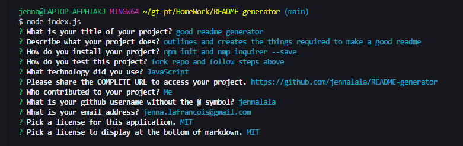

# README-generator

## Description

This application allows a user to dynamically generate a README markdown file directly from the terminal with prompts the user can follow and input, or select, to display. 

## Installation

Fork repository at [jennalala github](https://github.com/jennalala/README-generator) 

-npm init 

-npm inquirer --save

## Usage

This application allows a user to dynamically generate a ReadMe markdown file directly from the terminal with prompts the user can follow and input, or select, to display. 

## Contributing

A user can contribute by adding to the Table of Contents and creating a new section or adding more licenses to be chosen.

## ScreenShot

## Questions

####  **Jenna LaFrancois** 
*  **Github:** [@jennalala](https://github.com/jennalala)
*  **Email:** [jenna.lafrancois@gmail.com](jenna.lafrancois@gmail.com)
